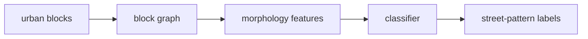

# street-pattern-classifier

Block-graph street-pattern classifier. It builds graph/morphology features and predicts interpretable street-pattern labels.

## System Map



## Main Result


## Run

Entrypoint: `usage.ipynb`

Human:

```bash
pip install -r requirements.txt && jupyter notebook usage.ipynb
```

Agent: inspect class balance and map samples, not only aggregate accuracy; mislabeled morphology is worse than missing labels.

## Publication

No standalone publication tracked; used by the street-pattern dissertation experiments. The README result image is copied from the downstream street-pattern experiment artifact.

## Next Steps / Heuristics

Heuristic: keep labels interpretable and stable across cities. Prefer a smaller class set over fragile fine-grained taxonomy.
